```{r xaringan-themer, include=FALSE, warning=FALSE}
options(htmltools.dir.version = FALSE)
list.of.packages <- c("xaringan", "xaringanthemer")
new.packages <- list.of.packages[!(list.of.packages %in% installed.packages()[,"Package"])]
if(length(new.packages)) install.packages(new.packages)

library(xaringanthemer)
style_mono_accent(
  base_color          = "#1c5253",
  header_h1_font_size = "2rem",
  header_h2_font_size = "1.55rem",
  header_font_google  = google_font("Josefin Sans"),
  text_font_google    = google_font("Montserrat", "300", "300i"),
  text_font_size      = "1.15rem",
  code_font_google    = google_font("Fira Mono")
)
```

# Outline

* Counterfactual approach to causal inference

* Correlations, counterfactuals, and potential outcomes

* Experiments: the gold standard of causal inference

* How to untangle cause and effect in observational studies
  - Control variables
  - Regression discontinuity design
  - Synthetic control (if time allows)

* Questions

---

class: center, middle, inverse

# Counterfactual approach to causal inference

---

# Recent changes in social science research

* Quantitative social sciences have experienced a "credibility revolution" ([Angrist and Pischke, 2010](https://www.aeaweb.org/articles?id=10.1257/jep.24.2.3))

* Problems of reverse causality and spurious correlations have long plagued quantitative studies
  - Economic growth or state capacity: what comes first?
  - Does cold air make you smarter?

* Development of _new methods_ to tackle these problems

* Great paradigm shift in social science research:
  - Being more precise about what we mean by causal effects
  - Widespread use of experimental and quasi-experimental designs
  - More partnerships between researchers and practitioners

---

# Examples

.center[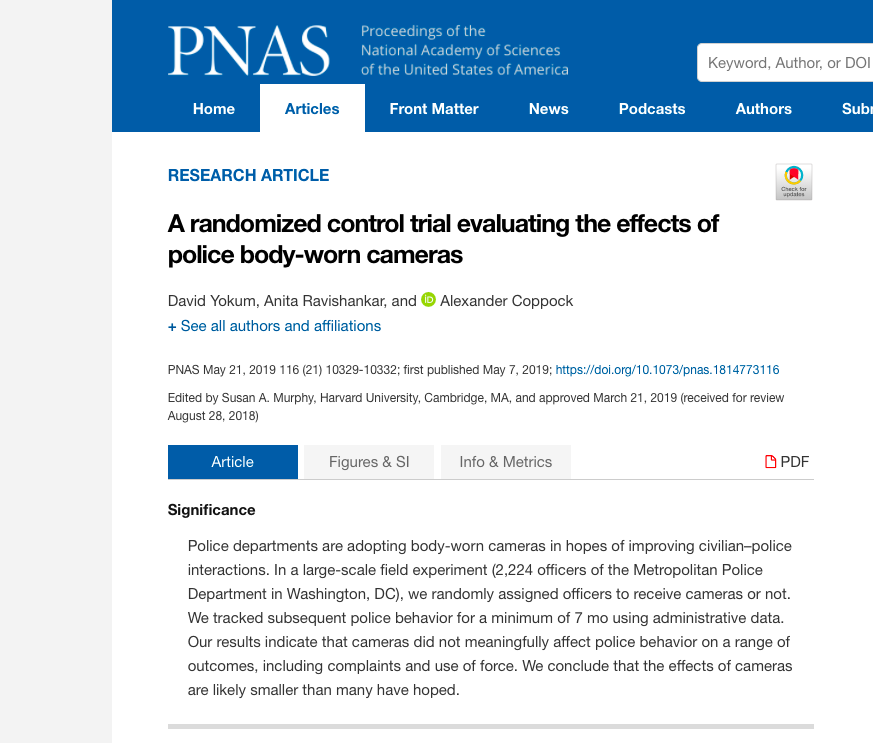]

---

# Examples

.center[]

---

# Examples

.center[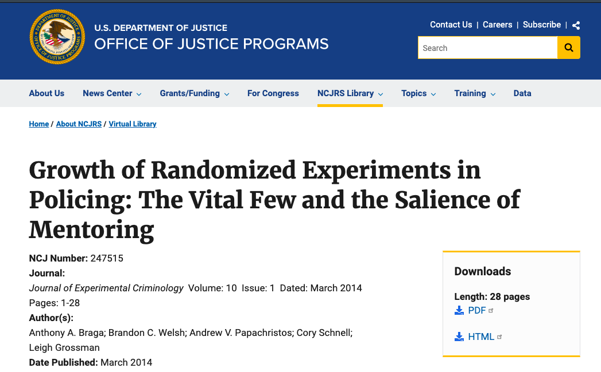]

---

# Two Nobel Prizes for the credibility revolution

.pull-left[]

.pull-right[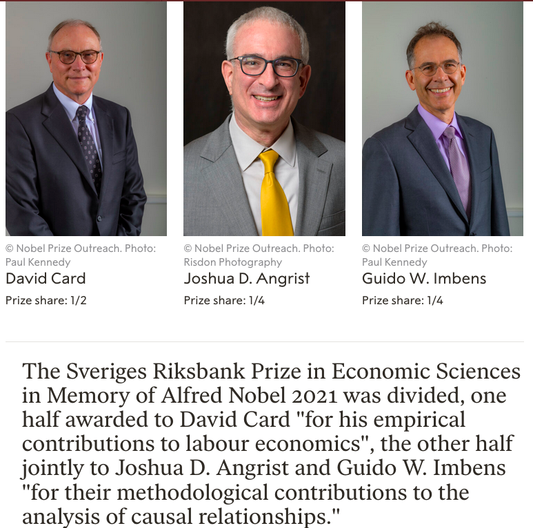]

---

class: center, middle, inverse


# Correlations, counterfactuals, and potential outcomes

---

# Correlation is not causation 

.center[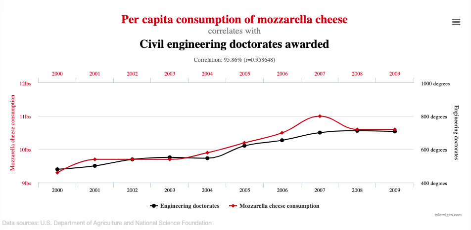]

---

# What does "cause" mean?

* Causal relationships have the following characteristics:

  - *Persistent association*: "We always/mostly see $Y = 1$ when $X = 1$ and $Y = 0$ when $X = 0$"

  - *Counterfactual difference*: "If $X$ had not been $1$, then $Y$ would not have been $1$"

  - *Difference after manipulation*: "When we change $X$ from $0$ to $1$, then $Y$ changes from $0$ to $1$
(establishes causal priority of $X$ over $Y$)"

  - **No causation without variation**

* " $X$ causes $Y$" need not imply that $W$ and $V$ do not cause $Y$: $X$ is a part of the story, not the whole story. (The whole story is not necessary in order to learn about whether $X$ causes $Y$)

* " $X$ causes $Y$" can mean "With $X$, the probability of $Y$ is higher than would be without $X$" or "Without $X$ there is no $Y$"

---

# Potential outcomes

* For each unit we assume that there are two **post-treatment** outcomes: $Y_i(1)$ and $Y_i(0)$

* $Y_i(1)$ is what we **would** obtain *if* the unit received the treatment ( $T_i=1$ )

* $Y_i(0)$ is what we **would** obtain *if* the unit received the treatment ( $T_i=0$ )

* The **causal effect** of treatment (relative to control) is:

<center> $\tau_i = Y_i(1) - Y_i(0)$ </center>

* Note that we've moved to using $T$ to indicate our treatment (what we want to learn the effect of). $X$ will be used for background variables

---

# Average causal effect

1. You have to define the control condition to define a causal effect
    - Say $T=1$ means a community meeting to discuss public health. Is $T=0$ no meeting at all?  Is $T=0$ a community meeting on a different subject?  Is $T=0$ a flyer on public health?

2. Each individual unit $i$ has its own causal effect $\tau_i$

3. But we can't measure the individual-level causal effect, because we can't observe both $Y_i(1)$ and $Y_i(0)$ at the same time. This is known as the **fundamental problem of causal inference**

* While we can't measure the individual causal effect, $\tau_i = Y_i(1)-Y_i(0)$, we can randomly assign subjects to treatment and control conditions to estimate the **average causal effect**, $\bar{\tau}_i$:

<center> $\overline{\tau_i} = \frac{1}{N} \sum_{i=1}^N ( Y_i(1)-Y_i(0) ) = \overline{Y_i(1)-Y_i(0)}$ </center>

* The average causal effect is also known as the **average treatment effect** (ATE)
 
---

# Omitted variables and selection bias

* Units must be comparable on average for us to estimate average causal effects

* Comparing units that are systematically different in some way (e.g., age, gender, etc) gives us _biased estimates_ for the average causal effect
  - Effect of conditional cash transfers in Norway and South Africa
  - Effect of community policing in London and in Rio de Janeiro

* Unknown factors that make units incomparable are called **omitted variables**, and the issue these variables introduce is called **selection bias**

* Therefore, to properly evaluate average causal effects, _we need to eliminate selection bias_

* Series of new, causal methods that try to reduce selection bias:
  - Randomised controlled trials (experiments)
  - Observational studies: control variables, regression discontinuity design, synthetic control

---

class: center, middle, inverse

# Randomised controlled trials: the gold standard of causal inference

---

# Why experiments?

* In RCTs, treatment is assigned _randomly_ to subjects

* As the treatment is given by the researcher, _we know that there is no selection bias by design_

* If we run the experiment in a random sample, we can estimate the ATE for the whole population

* **Randomised controlled trials are the best way to ensure that the effect we see is only caused by the treatment**

* Assumptions: the treatment is the only difference between the two groups, and no spillover from the treatment group

---

# Random sampling and random assignment

* Random sample of households

.center[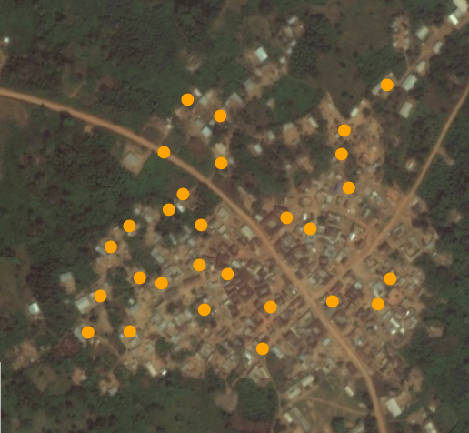]

---

# Random sampling and random assignment

* Random assignment of <span style="color:blue">control</span> and <span style="color:red">treatment</span> conditions

.center[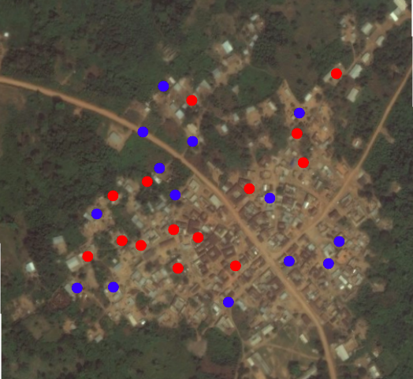]

---

# Example: hot-spots policing in Minneapolis

.center[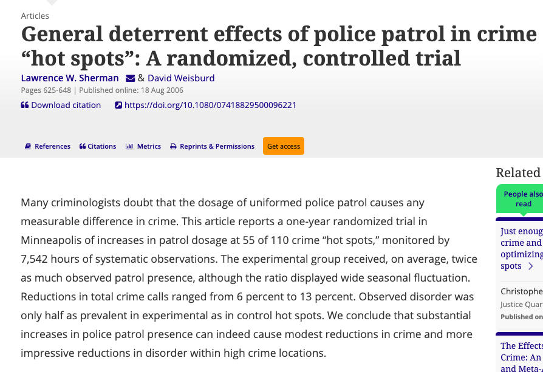]

---

# Treatment

.center[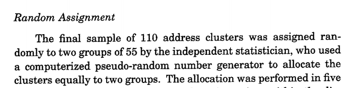]

.center[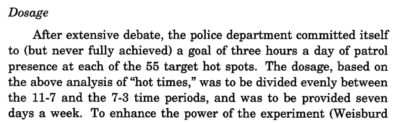]

.center[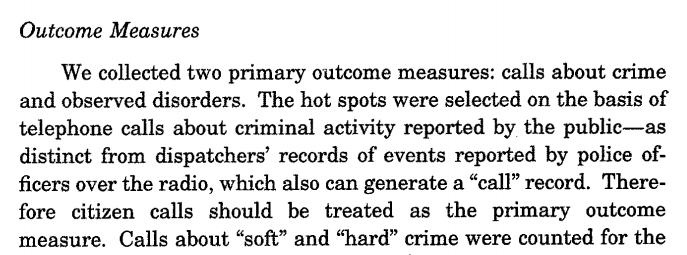]

---

# Results

.center[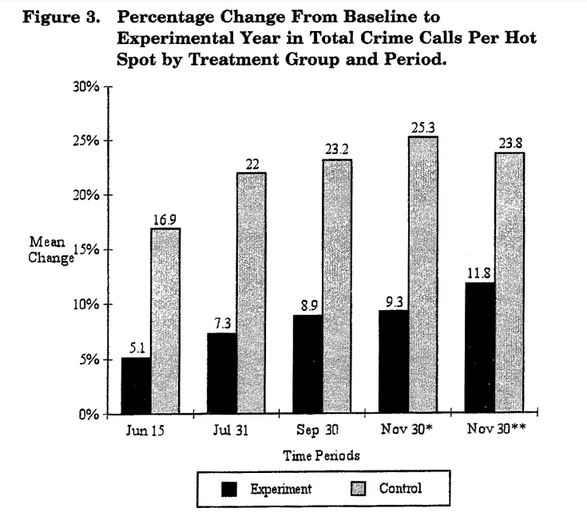]

---

class: center, middle, inverse

# Observational studies: how to create comparable groups

---

# What to do when treatment has not been randomised?

* Observational studies are more prone to selection bias

* As the treatment had not been given by the researcher, it can only be *observed*, not *manipulated*

* Therefore, we need to make statistical adjustments to ensure that units are comparable

* Three methods
  - Add control variables
  - Use discontinuities and analyse cases close to the threshold
  - Create a synthetic control group similar to the treatment group

---

# Regressions with control variables

* Most common method of statistical adjustment

* Researchers add _control variables_ to the model to reduce omitted variables bias

* By adding a new variable $Z$ to the regression, the model compares cases _holding that variable at its mean_

* $Y = \alpha + \beta X + \gamma Z + \epsilon$

* Issues: 
  - We can only control for factors we know about, _not for those which we didn't measure_
  - It is not always clear which factors must be included in the regression
  - Adding "bad controls" make the models _worse and more biased_

---

# Example: Factors that affect criminality 

.center[]

---


# Example: Factors that affect criminality

.center[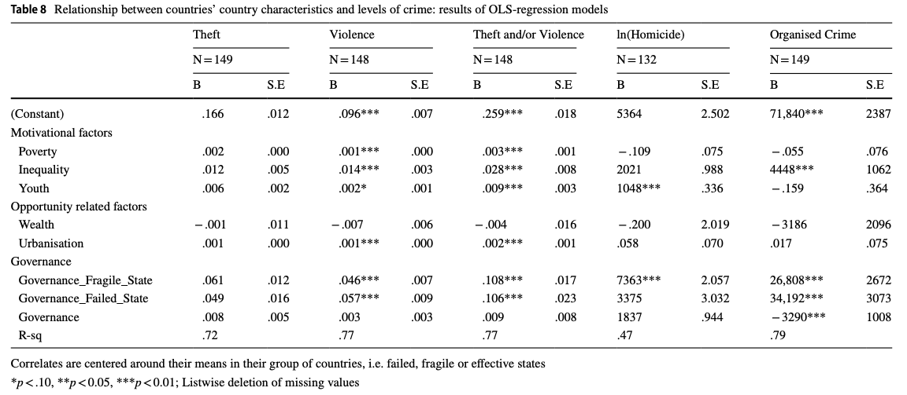]

---

# Regression discontinuity design

* Another way to obtain comparable units is to find a discontinuity (e.g., law changes, test results, etc) and analyse cases that are very close to the threshold

* Treatment is assigned to subjects _only on one side_ of the discontinuity

* When applied correctly, RDDs are almost as good as RCTs: cases close to the threshold are assigned randomly

* Assumptions:
  - Units cannot choose which side of the discontinuity they are assigned to
  - Only units that are close to the discontinuity can be compared: lower external validity

---

# Example: Effect of drunk driving on mortality rates

.center[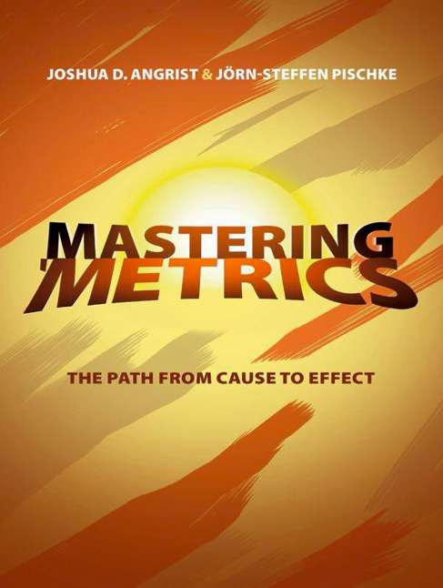]

---

# Example: Effect of drunk driving on mortality rates

.center[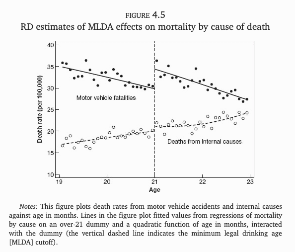]

---

# Synthetic control

* In many case, it isn't feasible to run an experiment or find a discontinuity to estimate the causal effect we're interested in

* One possible solution for time-series data is to create **a synthetic control group**

* Again, the goal is to have a control unit that is as close as possible to the treatment unit

* Synthetic control is a method that assigns weights to different units in _the control group pool_

* Used to estimate average causal effects over time

* Mathematically complex, but very intuitive

---

# Example: Effect of homicide policies on homicide rates

.center[]

---

# Example: Effect of homicide policies on homicide rates

.center[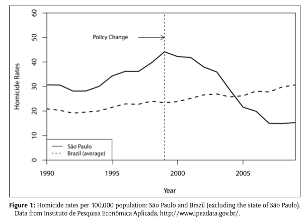]

---

# Example: Effect of homicide policies on homicide rates

.center[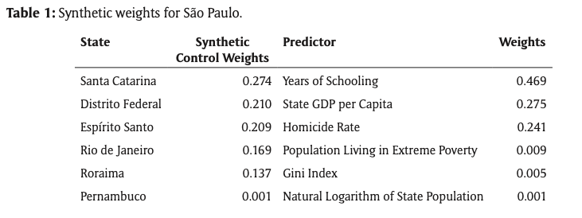]

---

# Example: Effect of homicide policies on homicide rates

.center[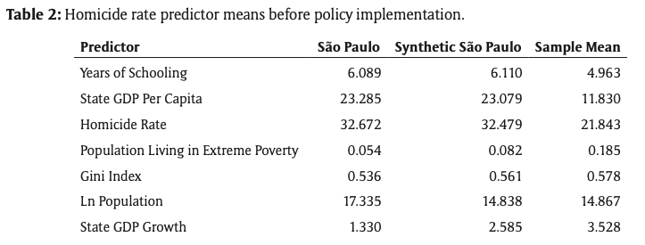]

---

# Example: Effect of homicide policies on homicide rates

.center[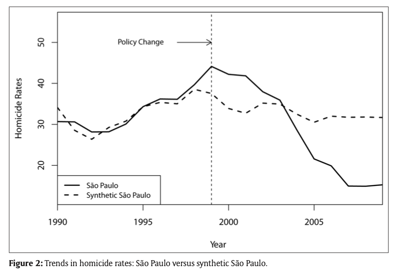]

---

# Wrap-up

* Quantitative social sciences have experienced a significant shift in the last few decades

* Causal inference models make statistical evidence much stronger

* Experiments are the gold standard for causal inference

* Randomisation is the best tool we have to deal with omitted variable bias

* When experiments are unfeasible or unethical to run, observational studies are our only option

---

# Wrap-up

* Correlation is not causation

* It's difficult to ensure that groups are comparable in observational studies

* You may include additional variables in regression models

* But ideally you should try to find a discontinuity in the data (laws, geography, population thresholds, etc)

* Lastly, if you cannot find a comparable control group, you can create a synthetic one and estimate the treatment effect over time

---

# Recommended readings

* Joshua Angrist and Stephen Pischke. [_Mastering 'Metrics: The Path from Cause to Effect_](https://www.masteringmetrics.com).
  Princeton University Press, 2014.

* Nancy Cartwright and Jeremy Hardie. [_Evidence-Based Policy: A Practical
  Guide to Doing It
  Better_](https://global.oup.com/academic/product/evidence-based-policy-9780199841622?cc=br&lang=en&).
  Oxford University Press, 2012.

* Scott Cunningham. [_Causal Inference: The Mixtape_](https://mixtape.scunning.com/). Yale Press, 2021.

* Alan Gerber and Donald Green. [_Field Experiments: Design, Analysis, and
  Interpretation_](https://wwnorton.com/books/9780393979954). Norton Books,
  2012.

* Miguel Hernán and James M. Robins. [_Causal Inference: What If?_](https://www.hsph.harvard.edu/miguel-hernan/causal-inference-book/). Chapman & Hall/CRC, 2020. 

* Paul Holland. "[Statistics and Causal
  Inference](https://www.jstor.org/stable/2289064)". _Journal of the American
  Statistical Association_, 81:945–960, 1986.

---

# Recommended readings

* Guido Imbens and Donald Rubin. [_Causal Inference in Statistics, Social, and
  Biomedical Sciences_](https://doi.org/10.1017/CBO9781139025751). Cambridge
  University Press, 2015.

* Stephen Morgan and Christopher Winship. [_Counterfactuals and Causal Inference:
  Methods and Principles for Social
  Research_](https://www.cambridge.org/core/books/counterfactuals-and-causal-inference/5CC81E6DF63C5E5A8B88F79D45E1D1B7).
  Cambridge University Press, 2014.

* Judea Pearl. [_Causality: Models, Reasoning, and
  Inference_](http://bayes.cs.ucla.edu/BOOK-2K/). Cambridge University Press,
  2000.

* Judea Pearl and Dana Mackenzie. [_The Book of Why: The New Science of Cause
  and Effect_](http://bayes.cs.ucla.edu/WHY/). Basic Books, 2018.

* Thomas Richardson and James Robins. "[Single World Intervention Graphs (swigs):
  A Unification of the Counterfactual and Graphical Approaches to
  Causality](https://csss.uw.edu/research/working-papers/single-world-intervention-graphs-swigs-unification-counterfactual-and)".
  Center for the Statistics and the Social Sciences, University of Washington
  Series. Working Paper, 128(30), 2013.

---

class: center, middle, inverse

# Thanks very much! :)

---

# Contact information

<br>

* Danilo Freire:

  - [dfreire@lincoln.ac.uk](mailto:dfreire@lincoln.ac.uk)
  - <http://danilofreire.github.io>
  - <http://github.com/danilofreire/phd-seminar-2022>

